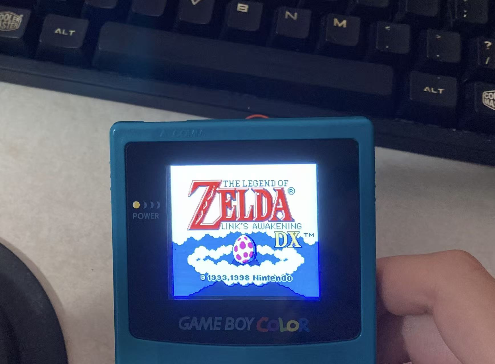
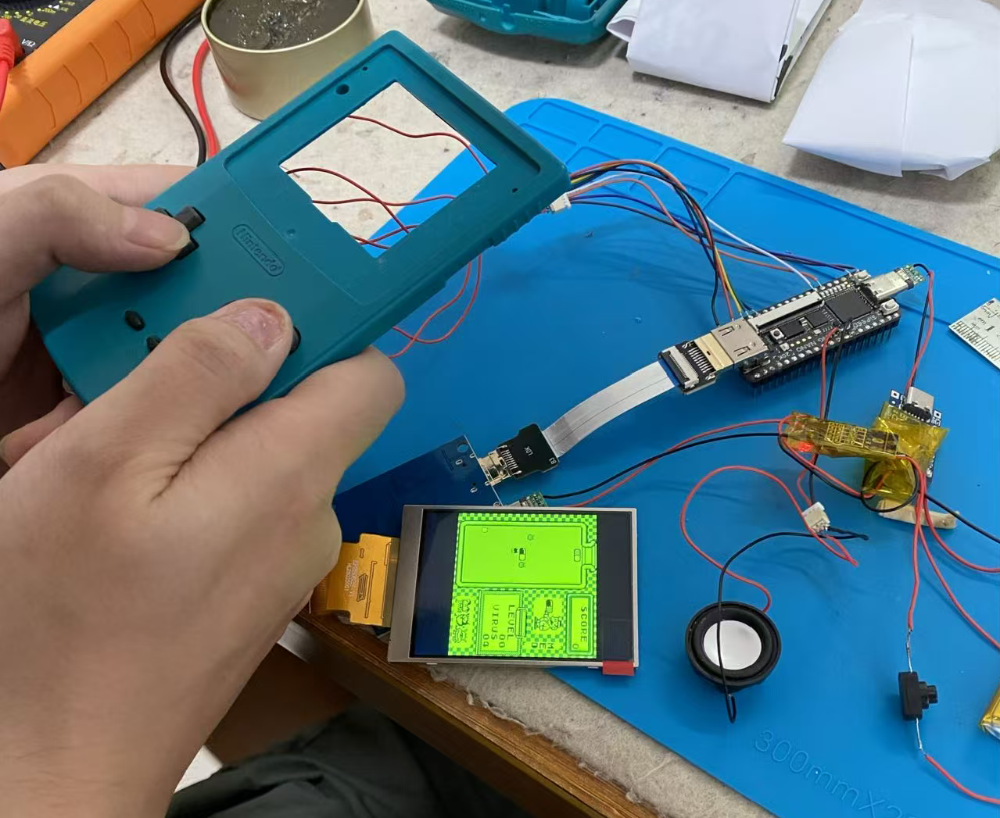

# GBCandy Nano

**Game Boy / Game Boy Color on Tang Nano 20K FPGA**

[English](README.md)

GBCandy Nano 是一个开源的 FPGA Game Boy / Game Boy Color 模拟器项目，运行在 Sipeed Tang Nano 20K 开发板上。它实现了完整的 Game Boy 硬件逻辑，包括 CPU、PPU、APU、Timer 和 MBC Mapper，可以在 FPGA 上运行原版 Game Boy 游戏。

## 预览





## 特性

- **完整的 LR35902 CPU 实现** — 精确周期的 Game Boy CPU，支持全部指令集（包括 CB 前缀指令）
- **PPU 像素处理单元** — 支持背景、窗口和精灵渲染，4 色 DMG 调色板 / CGB 彩色调色板
- **APU 音频处理单元** — 4 通道音频（方波×2、波形、噪声），支持 I2S 输出
- **Timer 定时器** — 完整的 DIV/TIMA/TMA/TAC 寄存器实现
- **MBC Mapper** — 支持 MBC1/MBC3/MBC5 卡带映射
- **OAM Bug 模拟** — 精确还原 DMG 硬件的 OAM 损坏行为
- **SDRAM 存储** — 64Mbit 嵌入式 SDRAM 用于 ROM/VRAM/WRAM
- **IOSys ROM 加载** — 通过 SPI Flash / SD 卡加载游戏 ROM
- **OSD 菜单** — 按 R+Start 切换 OSD 菜单

## 分支说明

本仓库提供两个硬件配置分支，适配不同的显示和输入方案：

### `main` 分支 — 720p HDMI + DS2 手柄

- **视频输出**: 720p (1280×720) HDMI，4 倍缩放显示 GB 160×144 画面
- **输入**: DualShock 2 手柄
- **LED**: 6 个板载 LED 调试指示
- **适用场景**: 连接 HDMI 显示器 + DS2 手柄使用

### `hdmi_lcd_480_640` 分支 — 480×640 + GBC 按键

- **视频输出**: 480×640 VGA 分辨率 HDMI 输出
- **输入**: 直接连接 GBC 按键（方向键 + A/B/Select/Start）
- **适用场景**: 连接小型 LCD 屏幕 + 自制 GBC 按键面板

## 硬件要求

- **FPGA 开发板**: Sipeed Tang Nano 20K (GW2AR-LV18QN88C8)
- **存储**: 板载 64Mbit SDRAM + SPI Flash + SD 卡
- **音频**: 板载 MAX98357A I2S D 类功放
- **输入**:
  - `main` 分支: DualShock 2 手柄
  - `hdmi_lcd_480_640` 分支: GBC 按键面板
- **显示**: HDMI 显示器或 LCD 屏幕

## 构建与烧录

### 环境要求

- **Gowin IDE 1.9.9 Pro**（需要免费许可证）
- Tang Nano 20K 开发板

### 构建

```bash
# 使用 Gowin 命令行工具构建
gw_sh build.tcl nano20k

# 或在 Windows 上使用批处理脚本
buildall.bat
```

构建输出位于: `impl/pnr/gbcandy_test.fs`

### 烧录

1. 通过 USB 连接 Tang Nano 20K 到电脑
2. 打开 Gowin Programmer
3. 选择 `.fs` 文件
4. 烧录到 FPGA

## 项目结构

```
├── src/
│   ├── gbc_top.v                 # 顶层模块
│   ├── gb_cpu.v                  # LR35902 CPU
│   ├── gb_apu.v                  # APU 音频处理单元
│   ├── gb_timer.v                # Timer 定时器
│   ├── gb_mbc.v                  # MBC Mapper
│   ├── gb_cart_ram.v             # 卡带 RAM
│   ├── gb_sdram_if.v             # SDRAM 接口
│   ├── gb_oam_dp.v               # OAM 双端口 RAM (Gowin DP BSRAM)
│   ├── oam_bug.v                 # OAM Bug 模拟器
│   ├── boot_rom.v                # 启动 ROM
│   ├── CEGen.v                   # 时钟使能生成器
│   ├── gbc_hdmi.v                # HDMI 输出
│   ├── gbc_ppu.v                 # PPU 输出适配
│   ├── gbc_rom_loader.v          # ROM 加载器
│   ├── apu_*.v                   # APU 子模块
│   ├── gb_cpu_modules/           # CPU 子模块
│   │   ├── alu.v                 # 算术逻辑单元
│   │   ├── control.v             # 控制单元
│   │   ├── ppu.v                 # PPU 核心
│   │   └── ...
│   ├── hdmi2/                    # HDMI 输出模块
│   ├── nano20k/                  # 板级配置和约束
│   └── iosys/                    # IOSys ROM 加载系统
├── firmware/                     # RISC-V 固件 (IOSys)
├── build.tcl                     # Gowin 构建脚本
└── buildall.bat                  # Windows 批量构建脚本
```

## 内存映射

| 地址范围 | 用途 |
|----------|------|
| 0x0000-0x7FFF | ROM（卡带，通过 MBC 映射）|
| 0x8000-0x9FFF | VRAM (8KB) |
| 0xA000-0xBFFF | 卡带 RAM |
| 0xC000-0xDFFF | WRAM (8KB DMG / 32KB GBC) |
| 0xE000-0xFDFF | Echo RAM（WRAM 镜像）|
| 0xFE00-0xFE9F | OAM（精灵属性内存）|
| 0xFF00-0xFF7F | I/O 寄存器 |
| 0xFF80-0xFFFE | HRAM |
| 0xFFFF | IE（中断使能）|

## 时钟体系

| 时钟 | 频率 | 用途 |
|------|------|------|
| sys_clk | 27 MHz | 系统时钟（晶振输入）|
| mclk | 21.6 MHz | CPU/PPU 时钟域 |
| fclk | 86 MHz | SDRAM 时钟域 |
| hclk | 14.85 MHz | HDMI 像素时钟（`main` 分支）|
| hclk5 | 74.25 MHz | HDMI 串行时钟（`main` 分支）|

CPU 通过 CE (Clock Enable) 分频从 21.6 MHz 得到 ~4.194304 MHz 的 Game Boy 标准时钟。

## 测试状态

### blargg CPU 测试
- **cpu_instrs**: ✅ 通过

### blargg DMG Sound 测试
- **01-registers**: ✅ 通过
- **02-len_ctr**: ✅ 通过
- **03-trigger**: ⚠️ 部分
- **04-sweep**: ⚠️ 部分

## 鸣谢

本项目站在以下优秀开源项目的肩膀上，在此向所有原作者致以最诚挚的感谢：

- **[SNESTang](https://github.com/nand2mario/snestang)** by nand2mario — 本项目的基础框架。GBCandy 的 SDRAM 控制器、HDMI 输出、IOSys ROM 加载系统、Gowin DP BSRAM 原语封装等核心基础设施均源自 SNESTang 项目。没有 SNESTang 就没有 GBCandy。

- **[VerilogBoy / FPGAMB0](https://github.com/f32organization/gb.fpga)** by Wenting Zhang (zephray) — Game Boy CPU (LR35902)、PPU 和 APU 的核心实现参考。GBCandy 的 CPU 指令集、PPU 渲染逻辑和 APU 音频通道均基于 VerilogBoy 的架构进行移植和适配。

- **[HDMI](https://github.com/sameer/hdmi)** by Sameer Puri — HDMI 1.4a 规范的 FPGA 实现，提供了 TMDS 编码、音频数据包等 HDMI 信号生成的完整解决方案。

- **[PicoRV32](https://github.com/YosysHQ/picorv32)** by Claire Xenia Wolf — 用于 IOSys 系统的 RISC-V 处理器核心，负责 ROM 加载和 OSD 菜单功能。

- **[FatFs](http://elm-chan.org/fsw/ff/00index_e.html)** by ChaN — 嵌入式 FAT 文件系统，用于 SD 卡文件读取。

- **[Gameboy_MiSTer](https://github.com/MiSTer-devel/Gameboy_MiSTer)** — MiSTer Game Boy/GBC 完整实现，在 PPU 时序和硬件行为验证方面提供了重要参考。

- **[epGB](https://github.com/ep209/epGB)** — Game Boy/GBC FPGA 实现，在 CGB 彩色模式和 HDMA 实现方面提供了参考。

- **[NESTang](https://github.com/nand2mario/nestang)** by nand2mario — Tang 开发板上的 NES 实现，在平台适配和工具链方面提供了参考。

## 参考文档

- [Pan Docs](https://gbdev.io/pandocs/) — Game Boy 完整硬件文档
- [Game Boy Architecture](https://www.copetti.org/writings/consoles/game-boy/) — Game Boy 架构分析
- [Gowin Semiconductor](https://www.gowinsemi.com/) — FPGA 工具链和文档

## 许可证

本项目采用 [GNU General Public License v3.0](LICENSE) 许可证。

项目中的部分代码来自其他开源项目，保留了各自原有的许可证和归属声明：

- SNESTang 代码: GPL v3
- VerilogBoy 代码: GPL v3
- HDMI 模块: BSD 3-Clause (Sameer Puri)
- PicoRV32: ISC (Claire Xenia Wolf)
- FatFs: FatFs License (ChaN)
- Gowin IP 文件: Gowin Semiconductor Corporation 版权

## 作者

Yulin Kuang

---

*GBCandy Nano — Game Boy on FPGA, with love.*
